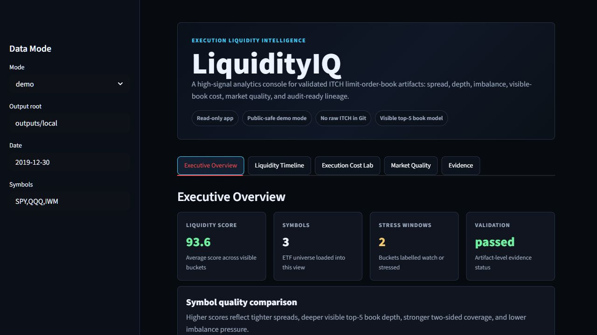
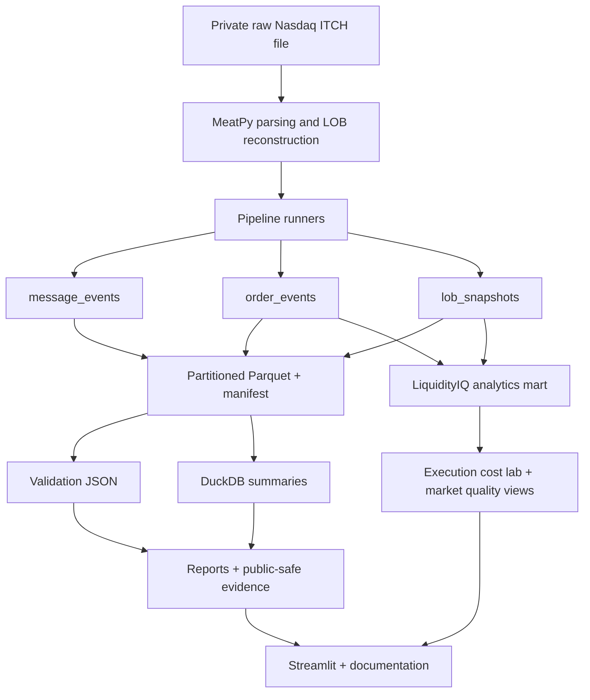
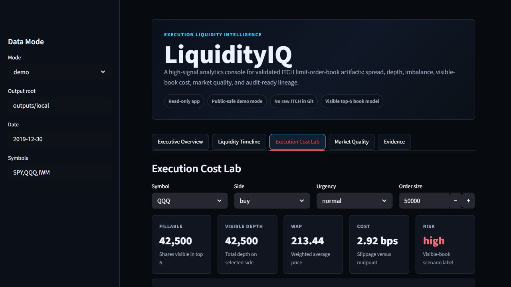
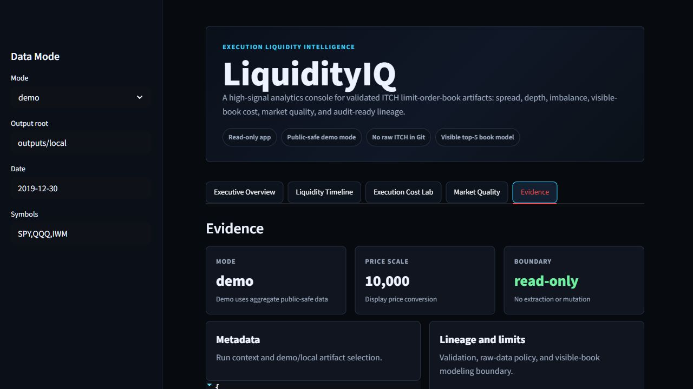

# HPC Market Data Engineering Pipeline for Reliable ITCH Processing

[](https://github.com/HetAshar13/itch-data-pipeline/actions/workflows/ci.yml)

I built this project to show the data engineering work around a difficult market
data source: Nasdaq ITCH is high-volume, binary, licensed data, and it is not a
ready-made analytics table. The pipeline turns parsed ITCH messages into
validated, partitioned artifacts with lineage, validation reports, DuckDB
summaries, Docker/CI checks, and Iris HPC proof.

The project does not implement a custom ITCH parser. MeatPy handles the
protocol parsing and limit order book reconstruction; this repo focuses on the
engineering layer around it.

## LiquidityIQ

LiquidityIQ is the business-facing product layer on top of the validated
pipeline. It turns ITCH limit-order-book artifacts into execution liquidity intelligence:
spread, top-5 depth, imbalance, event intensity, visible-book cost estimates,
stress regimes, and audit-ready lineage.

It is not a trading strategy, price prediction system, or full transaction cost
analysis product. It is a realistic pre-trade and market-quality analytics app
that shows how the pipeline can support business decisions without exposing raw
Nasdaq data.



## At A Glance

| Proof point | Result |
| --- | --- |
| LiquidityIQ | Read-only Streamlit analytics app with public-safe demo mode |
| SPY until-EOF HPC run | `29,156,757` messages scanned, `614,578` LOB snapshots |
| 10M multi-symbol LOB run | `535,626` snapshots across `SPY`, `QQQ`, and `IWM` |
| Message-event dataset | `1,000,000` parsed ITCH message rows |
| Order-event dataset | `796,151` order-event rows |
| Validation | Message, order, and LOB artifacts passed structural/sanity checks |
| Test suite | `138` passing tests |
| Runtime proof | Docker test runtime, GitHub Actions CI, Iris SLURM logs |
| Data safety | Raw Nasdaq data and large Parquet outputs excluded from Git |

## Architecture



Streamlit remains read-only. It reads existing artifacts or tracked aggregate
demo data and does not run extraction, validation, raw ITCH access, SLURM jobs,
or data mutation.

## Engineering Decisions I Made

- I used MeatPy instead of writing a parser because protocol correctness belongs
  in a dedicated market-data library, not in a portfolio pipeline.
- I kept `message_events` as a broad audit dataset and `order_events` as a
  focused analytical dataset so the pipeline preserves both coverage and
  usability.
- I validate before querying so DuckDB summaries are based on artifacts that
  already passed structural and sanity checks.
- I store ITCH prices as raw integer units to avoid pretending the project has
  completed price-normalization work it has not done.
- I copy back small proof artifacts rather than raw data or large Parquet files
  because the raw feed is licensed and the GitHub repo must stay public-safe.

## Data Products

- `message_events`: broad audit table from parsed MeatPy messages.
- `order_events`: add, cancel, delete, replace, and execution event rows.
- `lob_snapshots`: top-5 bid/ask limit order book snapshots for target symbols.
- `liquidity_bars`: 1-minute liquidity mart used by LiquidityIQ for spread,
  depth, imbalance, event intensity, ratios, scores, and stress labels.

Dataset paths, schemas, validation guarantees, and raw-price policy are
documented in [Data Contracts](docs/DATA_CONTRACTS.md).

## Evidence And Reports

Start here:

- [Portfolio Case Study](reports/portfolio_case_study.md)
- [LiquidityIQ Case Study](reports/liquidityiq_case_study.md)
- [Final Evidence Report](reports/final_evidence_report.md)
- [10M LOB Comparison](reports/lob_10m_comparison.md)
- [Artifact Evidence Index](reports/artifact_evidence_index.md)
- [Curated Evidence Artifacts](evidence/README.md)

## Product Screenshots

| Overview | Execution Cost Lab | Evidence |
| --- | --- | --- |
|  |  |  |

The curated `evidence/` directory contains SLURM logs, manifests, validation
JSON, and DuckDB summary JSON. It does not contain raw ITCH, `part-000.parquet`,
local `outputs/`, ignored `logs/`, credentials, or private config files.

## Reproducibility

### Local

```powershell
python -m venv .venv
.\.venv\Scripts\Activate.ps1
python -m pip install --upgrade pip
pip install -r requirements.txt
pip install -e .
python -m pytest
python -m itch_data_pipeline.cli healthcheck
```

### Docker

```powershell
docker build -t itch-data-pipeline:test .
docker run --rm itch-data-pipeline:test
docker run --rm itch-data-pipeline:test python -m itch_data_pipeline.cli healthcheck
docker run --rm itch-data-pipeline:test python -m itch_data_pipeline.cli check-raw-data-safety
```

### Iris HPC

HPC execution is documented in the [Operations Runbook](docs/OPERATIONS_RUNBOOK.md).
Jobs are submitted through SLURM scripts under `hpc/`, and only public-safe proof
artifacts are copied back.

## Public Safety

Nasdaq ITCH data is licensed. This repository is designed to be inspectable
without access to the raw feed.

Excluded from Git:

- `data/`
- `outputs/`
- ignored `logs/`
- `.venv/`
- `*.parquet`
- raw `*.gz` files
- private local configs

## Project Docs

- [Data Contracts](docs/DATA_CONTRACTS.md)
- [Reproducibility Guide](docs/REPRODUCIBILITY.md)
- [Operations Runbook](docs/OPERATIONS_RUNBOOK.md)
- [Professor Showcase Guide](docs/PROFESSOR_SHOWCASE_GUIDE.md)
- [Decisions Log](docs/DECISIONS.md)

## Limitations

- Core datasets store ITCH prices as raw integer units; LiquidityIQ adds separate
  display prices using an explicit `10,000` scale.
- Validation is structural plus sanity checking; it does not prove complete market microstructure correctness.
- Multi-symbol comparisons are bounded by message count; only SPY has an until-EOF LOB run.
- Visible-book cost estimates use top-5 displayed depth only; they are not full
  market-impact estimates, trading advice, or alpha signals.
- Large Parquet outputs remain private and are intentionally excluded from Git.
- The project avoids Spark, Airflow, Kafka, Snowflake, dbt, Prefect, ML, and dashboard sprawl.
